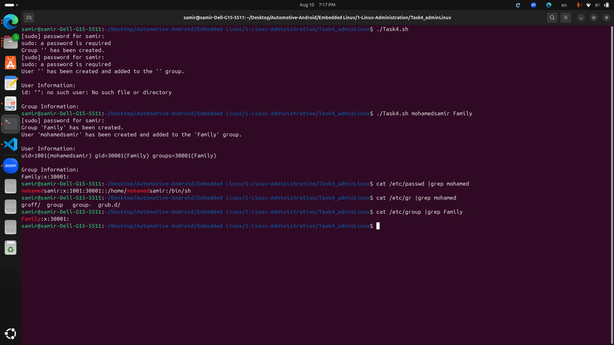
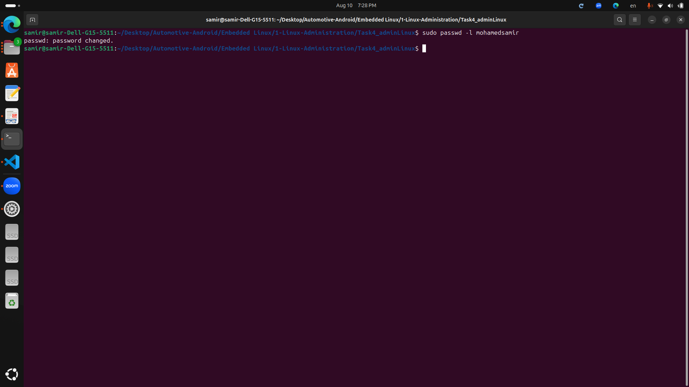
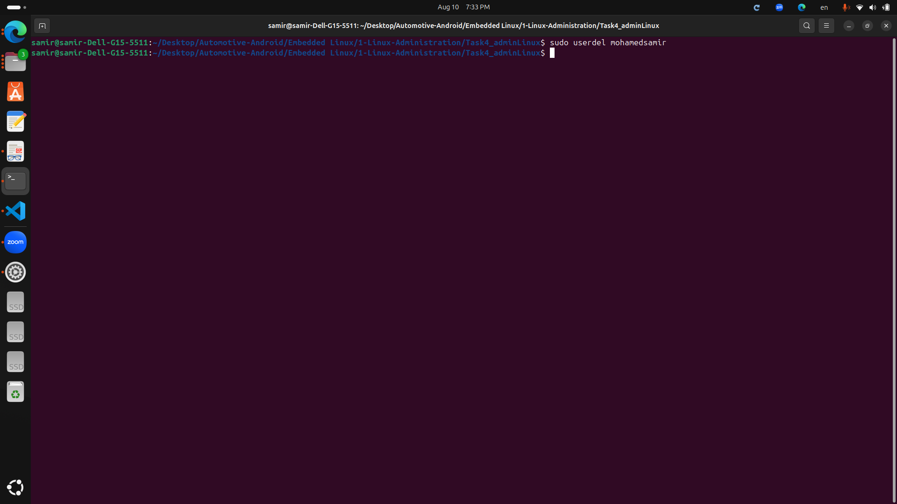

# Task4

***What is a Bash script that creates a user named 'yourName' and adds them to the 'FamilyName' group, checking for existing user and group, and displaying relevant information for the user and group***
```
#!/bin/bash

# Variables for the user and group names
USER_NAME="yourName"
GROUP_NAME="FamilyName"

# Check if the group already exists
if getent group "$GROUP_NAME" >/dev/null; then
    echo "Group '$GROUP_NAME' already exists."
else
    # Create the group if it doesn't exist
    sudo groupadd "$GROUP_NAME"
    echo "Group '$GROUP_NAME' has been created."
fi

# Check if the user already exists
if id "$USER_NAME" >/dev/null 2>&1; then
    echo "User '$USER_NAME' already exists."
else
    # Create the user and add them to the group
    sudo useradd -m -g "$GROUP_NAME" "$USER_NAME"
    echo "User '$USER_NAME' has been created and added to the '$GROUP_NAME' group."
fi

# Display information about the user and group
echo
echo "User Information:"
id "$USER_NAME"

echo
echo "Group Information:"
getent group "$GROUP_NAME"

```


***Create a supplementary (Secondary) group called pgroup with group ID of 30000***
```
sudo groupadd -g 30000 pgroup
```


***Lock any user created account so he can't log in***


***Delete user account***
```
sudo userdel yourName
```


***Delete group account***
```
sudo groupdel pgroup
```


***State the difference between adduser and useradd with example shown.***
## adduser:

***adduser is a higher-level command that is more user-friendly***

- It is a Perl script that uses useradd in the background.

- It prompts for additional information such as the user’s password, full name, room number, etc.

- It automatically creates a home directory, sets up permissions, and copies default files into the home directory.

Example:
```
sudo adduser yourName
```
This command will prompt you for additional information and then create the user with all default settings.

## useradd:

***useradd is a low-level command that provides more control over how the user account is created***

- It does not prompt for any additional information unless explicitly specified via command-line options.

- It requires more parameters to be specified if you want to customize the user creation process.

Example:
```
sudo useradd -m -d /home/yourName -s /bin/bash yourName
```
This command creates the user yourName, creates a home directory at /home/yourName, and sets the default shell to /bin/bash.
