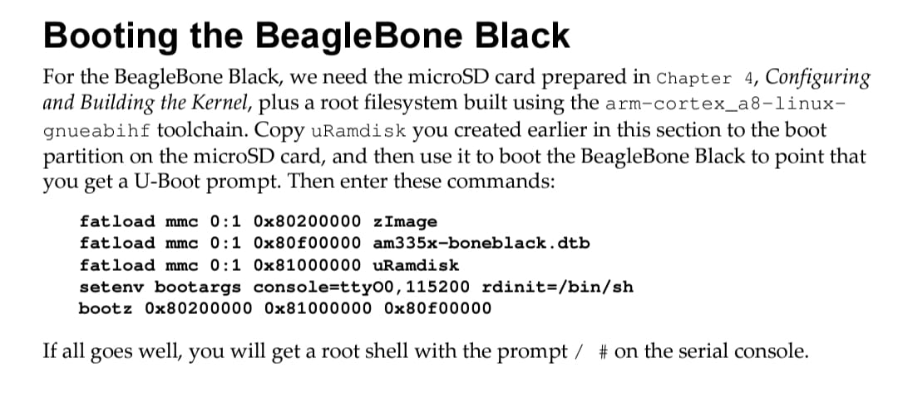

# Intermediate Ram file system
InitRamFS serves as a temporary root filesystem during the Linux boot process, allowing the kernel to load necessary modules and drivers.

# Advantages

**Modular Kernel :** Enables the use of modular kernels by loading modules required for mounting the real root filesystem.

**Hardware Compatibility :** Helps in dealing with hardware-specific requirements, like RAID setups or special storage controllers, ensuring the system can mount the actual root filesystem.

**Kernel Size Reduction :** Keeps the kernel size smaller by offloading driver loading to InitRamFS, improving maintainability and boot flexibility.

**Simplified Boot Process :** Provides a consistent environment for initializing devices and filesystems before transitioning to the final root filesystem.

**User-Space Initialization :** Allows running user-space programs during the early boot stage for tasks like decrypting root filesystems or setting up network configurations.

## Build it in raspberry pi3b+.

> ## Kernel stage 
------------------------------------------------------------------

Download repo
			
------------------------------------------------------------------

```
git clone --depth=1 https://github.com/raspberrypi/linux
cd linux

```
Apply default config for RPi3
```
  make bcm2709_defconfig ARCH=arm CROSS_COMPILE=arm-linux-gnueabihf-
  or
  make bcm2835_defconfig ARCH=arm CROSS_COMPILE=arm-linux-gnueabihf-
```
Set maximum open file descriptors:

```bash
ulimit -n 8192
```

change in configuration
```

make menuconfig ARCH=arm CROSS_COMPILE=arm-linux-gnueabihf-

```


enable Initial RAM filesystem and RAM disk (initramfs/initrd) support .


enable Maintain a devtmpfs filesystem to mount at /dev and enable Automount devtmpfs at /dev, after the kernel mounted the rootfs


Compile kernel, modules and DTBs :

```bash
make -j$(nproc) zImage modules dtbs ARCH=arm CROSS_COMPILE=arm-linux-gnueabihf-
```

Install modules:

```bash
export INSTALL_MOD_PATH=~/Desktop/linux_raspberrypi/
make modules_install ARCH=arm CROSS_COMPILE=arm-linux-gnueabihf-
```
copy to sdacard

```
cp arch/arm/boot/zImage /media/boot
cp arch/arm/boot/dts/bcm2710-rpi-3-b-plus.dtb  /media/boot
cp arch/arm/boot/dts/overlays/disable-bt.dtbo /media/boot/overlays
cp libs -R  /media/rootfs/
```

> ## Busy Box stage
------------------------------------------------------------------

Download repo
			
------------------------------------------------------------------

```
git clone git://busybox.net/busybox.git --branch=1_33_0 --depth=1
cd BusyBox

````

```
export ARCH=arm
export CROSS_COMPILE=arm-linux-gnueabihf-
make menuconfig
```
Build static binary 	(no shared libraries) 	Enable


Cross compiler prefix 	arm-Linux-gnueabihf-


Destination path for ‘make install’ 


remove some error in make process

```
vim .config
cahnge CONFIG_TC = n

```


------------------------------------------------------------------

Build

------------------------------------------------------------------

```
make -j 8

make install

#The busybox binary and links will be installed in _install

```

------------------------------------------------------------------

Creating the ram File System

------------------------------------------------------------------

```
mkdir initramfs

mkdir -p initramfs/bin initramfs/sbin initramfs/etc initramfs/proc initramfs/sys initramfs/dev initramfs/usr/bin initramfs/usr/sbin

```
Copy the busybox binary and links:

```
cp -a busybox_raspberrypi/_install/* ./initramfs

```
Create the init script initramfs/init with the following content :

```
#!/bin/sh

mount -t devtmpfs devtmpfs /dev
mount -t proc none /proc
mount -t sysfs none /sys
exec /bin/sh

```
Make the init script executable :
```
chmod +x initramfs/init

```
compressed initramfs archive:
```
find . | cpio -H newc -ov --owner root:root > ../initramfs.cpio

cd ..

gzip initramfs.cpio

mkimage -A arm -O linux -T ramdisk -d initramfs.cpio.gz uRamdisk

cp uRamdisk /media/boot

```

------------------------------------------------------------------

Creating the Root File System

------------------------------------------------------------------

```
mkdir rootfs

mkdir -p rootfs/bin rootfs/sbin rootfs/etc rootfs/proc rootfs/sys rootfs/dev rootfs/usr/bin rootfs/usr/sbin

```

Copy the busybox binary and links:

```
cp -a busybox_raspberrypi/_install/* ./rootfs
sudo chown -R root:root *

```
Create the rcS script rootfs/etc/init.d/ with the following content :

```
#!/bin/sh
mount -t devtmpfs devtmpfs /dev
# mount a filesystem of type `proc` to /proc
mount -t proc nodev /proc
# mount a filesystem of type `sysfs` to /sys
mount -t sysfs nodev /sys


```
Change the Script permission to make it executable

```
chmod +x etc/init.d/rcS

```

Create the inittab Configuration file rootfs/etc/ with the following content :

```
#When system startup,will execute "rcS" script
::sysinit:/etc/init.d/rcS
#Start"askfirst" shell on the console (Ask the user firslty to press any key) 
ttyAMA0::askfirst:-/bin/sh
#when restarting the init process,will execute "init" 
::restart:/sbin/init

```

copy to sdacard :

```
cp -rp ~/rootfs/* /media/rootfs
```
------------------------------------------------------------------

run minicom
			
------------------------------------------------------------------

```
sudo minicom -D /dev/ttyUSB0

```


> ## run raspberry pi3b+

------------------------------------------------------------------

set Addresses
			
------------------------------------------------------------------

``` 
make $kernel_addr_r -> 0x01000000
make $fdt_addr_r -> 0x08000000 
make $initramfs_addr -> 0x10000000

```


------------------------------------------------------------------

load in ram
			
------------------------------------------------------------------

``` 
fatload mmc 0:1 $kernel_addr_r zImage 
fatload mmc 0:1 $fdt_addr_r  bcm2710-rpi-3-b-plus.dtb 
fatload mmc 0:1 $initramfs_addr uRamdisk 

```


------------------------------------------------------------------

set bootargs
			
------------------------------------------------------------------

according to Mastering Embedded linux programing book



``` 
edit bootargs

edit: console=ttyS0,115200 root=/dev/ram0 rdinit=/bin/sh    

```


------------------------------------------------------------------

Boot it!
			
------------------------------------------------------------------

``` 
bootz $kernel_addr_r $initramfs_addr $fdt_addr_r 

```


> ## initramfs stage - raspberry pi3b+


## Build it in qemu 

run qemu
			
------------------------------------------------------------------

``` 
sudo qemu-system-arm -M vexpress-a9 -nographic -net tap,script=./qemu_if_tap_up.sh -net nic -kernel u-boot -sd ~/Desktop/iti-image/samir_img1/samir_img1.img

``` 


------------------------------------------------------------------

set bootargs
			
------------------------------------------------------------------

``` 
edit bootargs

setenv bootargs 'console=ttyAMA0 root=/dev/mmcblk0p2 rootfstype=ext4 rw rootwait init=/sbin/init'

``` 


------------------------------------------------------------------

Boot it!
			
------------------------------------------------------------------

``` 
bootz $kernel_addr_r $initramfs_addr $fdt_addr_r 

```


> ## initramfs stage - qemu

